## Nurmumanagement
Task management web application built with Spring Boot using a monolithic MVC architecture.  

---

### Functionality

**User side**
- Session-based authentication for secure user access
- Password recovery via email with a one-time token
- Task list with sorting, search, and pagination
- Tasks with title, description, due date and time, categories, priority and status fields
- Account settings management

**Admin panel**
- Manage all registered users (add, remove, modify access roles)
- Manage predefined task categories and priorities

### Technologies Used
- Spring Boot — application framework
- PostgreSQL — relational database for storing users and tasks
- Thymeleaf — server-side templating engine for UI rendering
- Spring Security — session-based authentication and access control
- SendGrid API — email service for password recovery and notifications

### Requirements
- JDK 23
- PostgreSQL
- Sendgrid API key

### How to Run

1. Clone the repository \
`git clone https://github.com/eldin-j/nurmumanagement.git`
2. Create the PostgreSQL database \
`CREATE DATABASE task_app;`
3. Configure database credentials \
   Open `src/main/resources/application.properties` and specify your PostgreSQL username and password:
    ```
    spring.datasource.username=
    spring.datasource.password=
    ```
4. Set up SendGrid environment variables \
    Create a `.env` file in the project root directory and add:
    ```
    SENDGRID_API_KEY=
    SENDGRID_FROM_EMAIL=
    ```
5. Build and run the application \
   `./gradlew build` \
    `./gradlew bootRun`
6. Access at http://localhost:8080/login

### Screenshots

**Authentication**
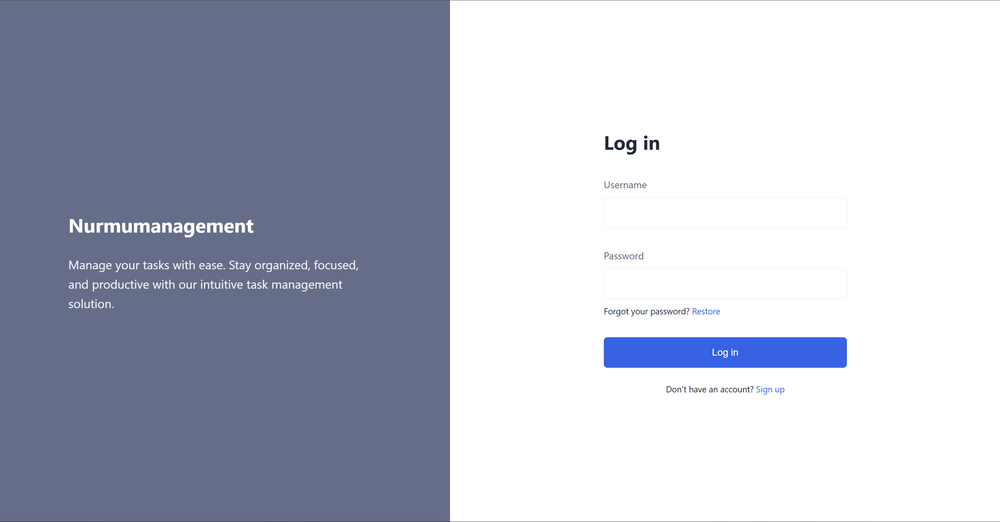
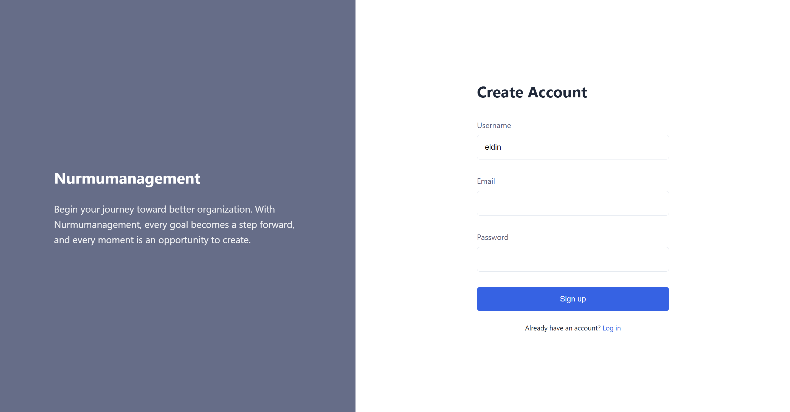
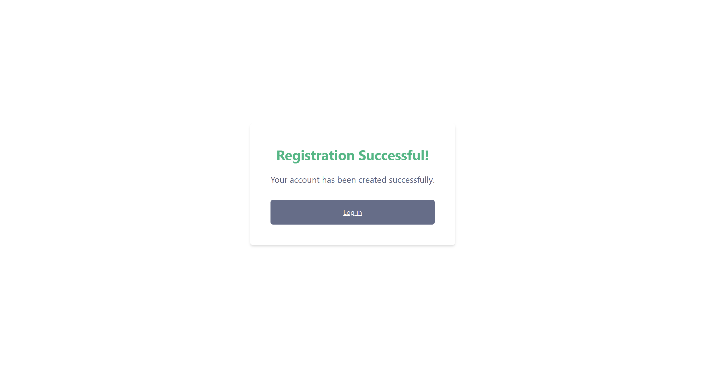

**Create/edit task**
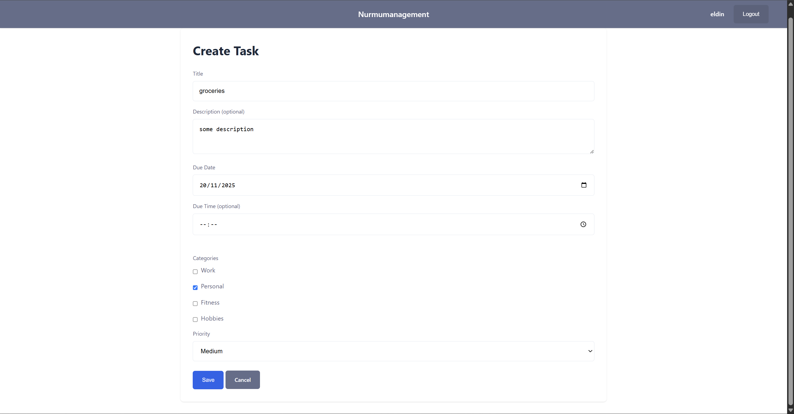
**Task list**
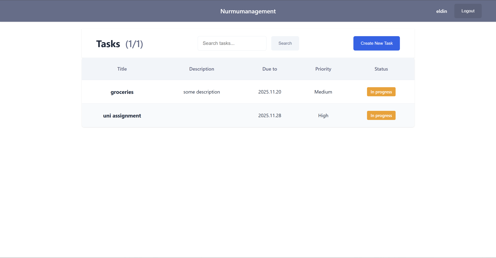
**Task page**
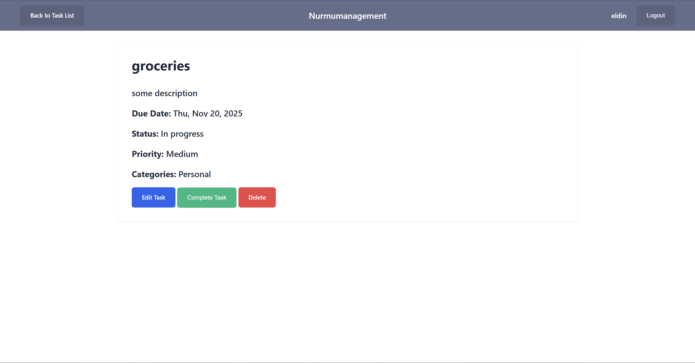
**Search**
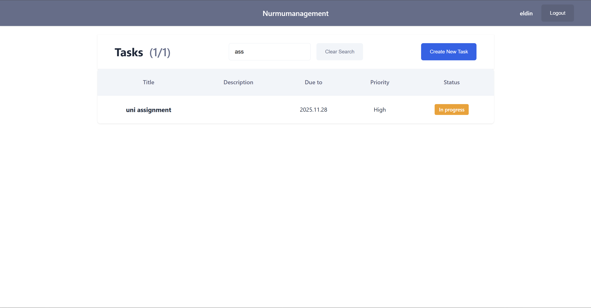

**Account settings**
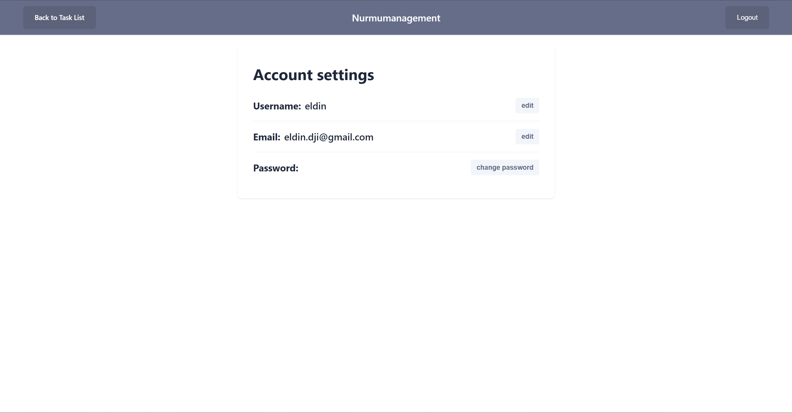
**Password recovery**
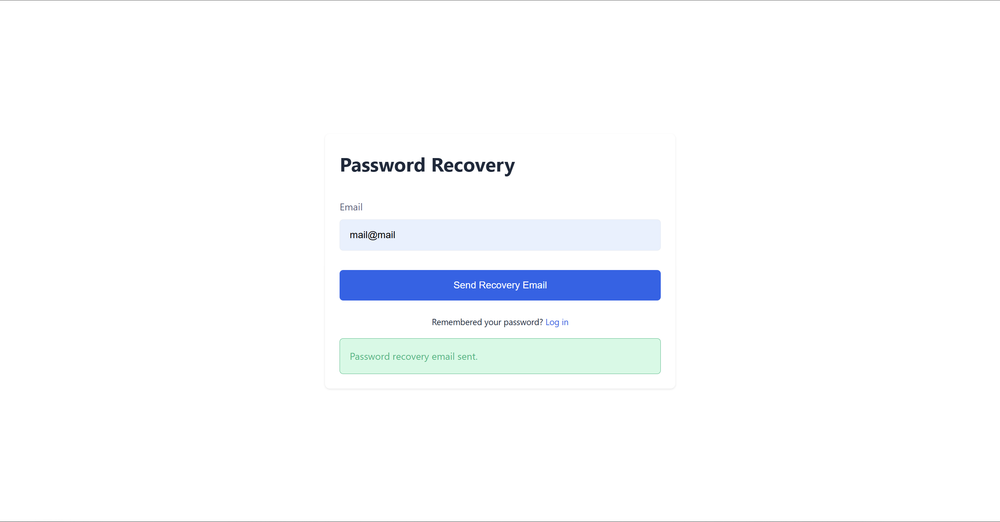
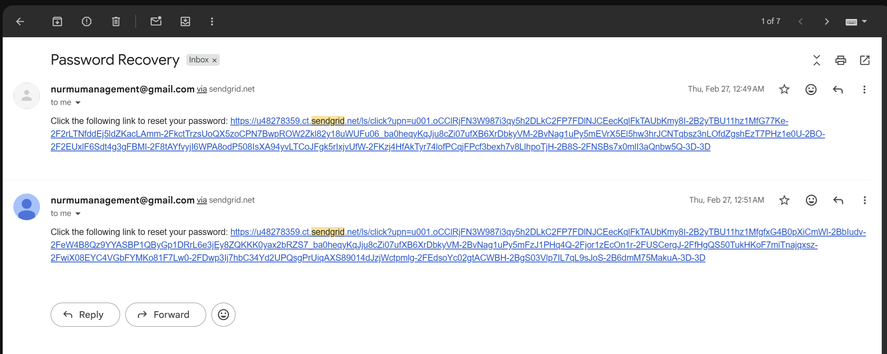

**Admin panel**
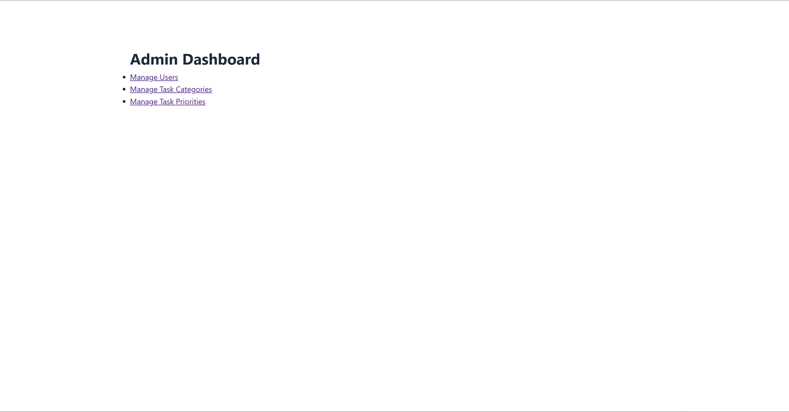
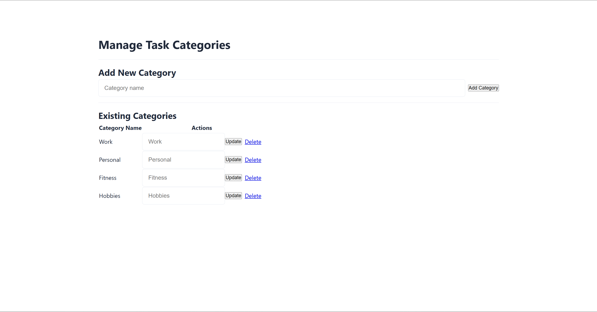